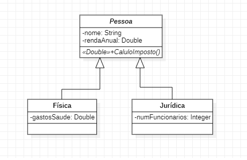

# Projeto Imposto Contribuinte
Um projeto para expor tecnologias e modelagem de dados

### Diagrama de Classes

As entidades são de pessoa física e pessoa jurídica:

A regra aplicada de forma simplificada foi que:

Pessoa Física: pessoas com renda anual abaixo de R$ 20.000,00 pagam 15% de impostos e as acima deste valor pagam 25% de impostos. 
Os gastos com saúde são abatidos 50% no imposto total.

Exemplo: Se a renda anual foi de R$ 100.000,00 e os gastos com saúde R$ 2000,00 (50% deste valor irá ser abatido como desconto no imposto), exemplo: 

(100.000,00 * 25%) - (2000,00 * 50%) = R$ 24.000,00 em impostos.

Pessoa Jurídica: pagam 16% de impostos. Se possuir mais de 10 funcionários pagam 14% de impostos.

## BackEnd Java utilizando as tecnologias:
* Orientado à Objetos
* Spring Boot
* JPA - Hibernate
* PostGreeSQL
* BootStrap
* HTML5
* CSS3

### FrontEnd
[Link da aplicação](https://imposto-contribuinte.herokuapp.com/) 